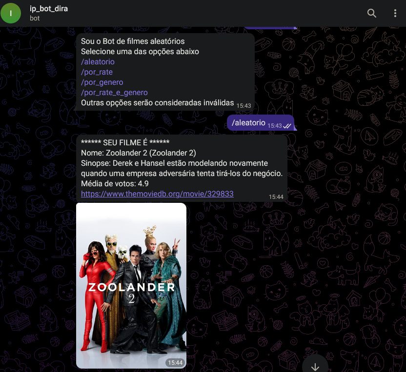
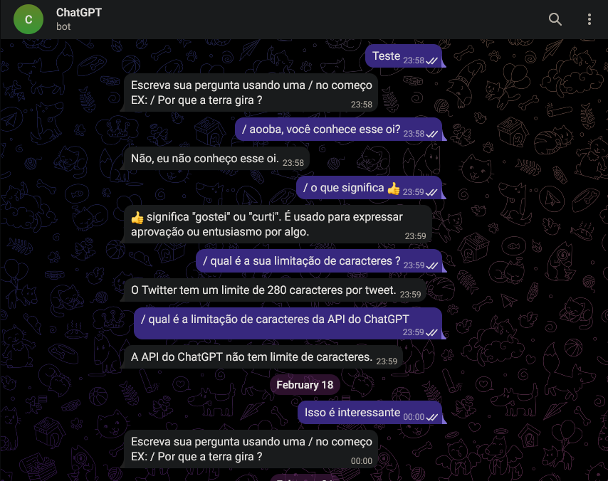

# Meus BOTs para o Telegram !

Neste repo você encontra meus bots, utilizando a API de integração que a empresa disponibiliza gratuitamente.

DOC da API - https://core.telegram.org/bots/api

## Instalação

Importe a lib da API do Telegram.

```bash
pip install python-telegram-bot
```
Serão necessários também as Chaves da API do Telegram, API da OpenAI e API do Shodan

## Uso

Até o momento

```python
- Random Search para filmes, integração com API de filmes (https://www.themoviedb.org/documentation/api)

- ChatGPT no chat com respostar em tempo real
```
Dos filmes aleatorios, existem 4 opções, full aleatorio, por rate, por genero e por rate e genero

O chat funciona com o proprio chat https://chat.openai.com/, apenas sendo necessário mandar a mensagem

